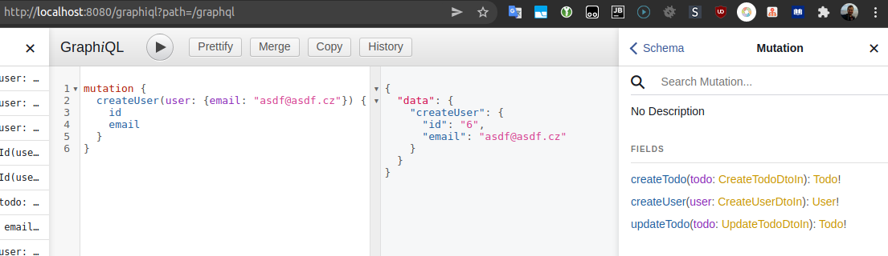

# Ukázka použití GraphQL a Spring Bootu

GRAPHIQL: http://localhost:8080/graphiql?path=/graphql



- Běží na Javě 17. 
- Využito _snapshot_ a _milestone_ repozitářů. 
- Pro ukládání data je využita H2 databáze. 
- Potřeba Lombok rozšíření 

**!!! nejdříve je potřeba přidat několik uživatelů. ID uživatele je hard-coded na hodnotu `2`.**

### Mutation
```graphql
mutation {
    createUser(user: {email: "email@seznam.cz"}) {
        id
        email
    }
}
```

```graphql
mutation {
    createTodo(todo: {title: "My new todo item", completed: false}) {
        id
        title
        completed
    }
}
```


### Query

```graphql
query {
    getTodosByUserId(userId: 2, pageInfo: {offset: 2, limit: 5}) {
        id
        title
        completed
        createdBy {
            id
            email
        }
    }
}
```
Get all users
```graphql
query {
    getUsers {
        id,
        email
    }
}
```
Recursive query
```graphql
query {
    getTodosByUserIdWithAnnotationResolver(
        userId: 2
        pageInfo: {offset: 2, limit: 5}
    ) {
        id
        title
        completed
        createdBy {
            id
            email
            todoList {
                id
                title
                createdBy {
                    id
                    email
                    todoList {
                        id
                        title
                        createdBy {
                            id
                            email
                            todoList {
                                title,
                                createdBy {
                                    email
                                }
                            }
                        }
                    }
                }
            }
        }
    }
}
```

----
- [ ] Vylepšit přidávání todo itemů (problém s uživateli)
- [ ] vylepšit vstupní parametry
- [x] Vytvořit typové resolvery 
- [ ] Vyřešit N+1 problém
- [ ] Vyřešit securitu
- [ ] Přidat vlastní datové typy
- [ ] Validace vstupních parametrů
- [ ] Pořešit stránkování
- [ ] Vyzkoušet Subscription
- [ ] Vytvořit základní GUI
- [ ] vyčistit kód
